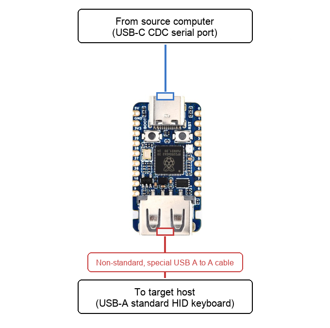
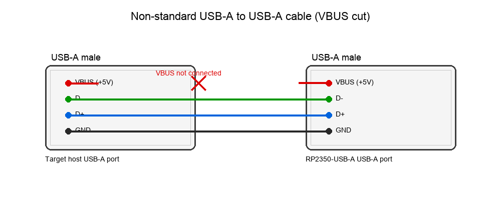

# PicoUSBKeyBridge

`PicoUSBKeyBridge` turns the [Waveshare RP2350-USB-A](https://www.waveshare.com/rp2350-usb-a.htm) into a
wired keyboard emulator. You can send keypresses programmatically over USB-C, while
the USB-A port behaves like a standard keyboard connected to a target host. Read
the wiring section carefully before connecting anything.

**WARNING: A special USB-A to USB-A cable is required and must be built.** The USB-A
port is used as a device/peripheral, so VBUS must be disconnected in the cable. Do
not use a standard A-to-A cable.



## Build

1. Install toolchain dependencies:
   - CMake
   - Ninja
   - GNU Arm Embedded toolchain (`arm-none-eabi-gcc`)

2. Initialize submodules:
```
git submodule update --init --recursive
```

3. Configure:
```
cmake -S . -B build
```

4. Build:
```
cmake --build build
```

UF2 output is in `build/` (e.g. `build/PicoUSBKeyBridge.uf2`).

## Flash

1. Hold **BOOT** and connect the board over USB-C.
2. A mass-storage device appears (BOOTSEL).
3. Copy `PicoUSBKeyBridge.uf2` to the BOOTSEL drive.

## Wiring checklist

- PIO USB uses GPIO12 (D+) and GPIO13 (D-).
- Use a **non-standard USB-A to USB-A** cable with **no VBUS connection** (cut VBUS in the cable).
- A USB-A male breakout like this can be used to build the cable:
  https://www.amazon.es/PNGKNYOCN-adaptador-hembra-unidades-Dupont/dp/B09YCC526T
- D+ pull-up should be present; D- pull-up should be absent.



**VBUS warning (important):** The PIO USB port uses a USB-A female connector, which is
normally **host-side** by USB spec. We are using it as a **device/peripheral**, so the
VBUS line must be **disconnected** in the A-to-A cable. If VBUS is left connected and
both sides supply 5V, you can back-power a host, damage ports, or create unsafe power
contention. This is why cutting VBUS is critical, and why the cable must be built
carefully.

## Serial protocol

The CDC interface expects a fixed 2-byte packet:

- **Byte 0**: USB HID keycode
- **Byte 1**: modifier bitmap

USB HID keyboard keycodes are defined in the HID Usage Tables (Keyboard/Keypad page)
and in TinyUSB’s `hid.h` constants.
- HID Usage Tables (Keyboard/Keypad): https://usb.org/sites/default/files/hut1_4.pdf
- TinyUSB keycode definitions: https://github.com/hathach/tinyusb/blob/6e891c6dc716d6ae91fdc54aaec2899f788e14fc/src/class/hid/hid.h#L389-L391

Modifier bitmap matches the USB HID keyboard modifier bits (macOS symbols):

- `0x01` Left Ctrl (⌃)
- `0x02` Left Shift (⇧)
- `0x04` Left Alt / Option (⌥)
- `0x08` Left GUI / Command (⌘)
- `0x10` Right Ctrl (⌃)
- `0x20` Right Shift (⇧)
- `0x40` Right Alt / Option (⌥)
- `0x80` Right GUI / Command (⌘)

Each packet generates a key press followed by a key release.

For example, this sequence:

```
04 00  04 02  1E 08
```

Corresponds to the keypress sequence [`a`, `A`, `⌘+1`]

Step-by-step:

1. `04 00` → HID keycode `0x04` corresponding to letter `a`, no modifier (produces `a`).
2. `04 02` → HID keycode `0x04` corresponding to letter `a`, with Left Shift `0x02` (produces `A`).
3. `1E 08` → HID keycode `0x1E` corresponding to `1`, with Left GUI/Command `0x08` (produces `⌘+1`).


CDC TX is reserved for **logs only**. The device never sends protocol bytes back,
so the host can safely read TX output as plain text logs.

Logs are buffered and only flushed once the CDC port is opened **and DTR is
asserted**. If you want logs, open the port and send DTR.