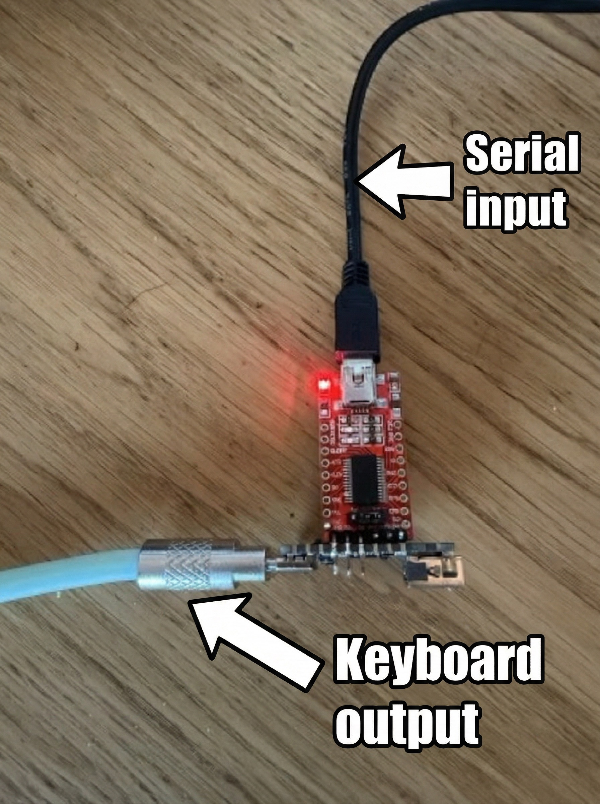

# PicoUSBKeyBridge

PicoUSBKeyBridge turns a Raspberry Pi Pico-class board (RP2040/RP2350) into a wired keyboard emulator.
It accepts key event packets over UART and exposes a USB HID keyboard to a target host (iPad, macOS, etc).

## Related projects

- [keybridged](https://github.com/2opremio/keybridged): Go HTTP daemon + client library that sends key events to bridge firmware over UART/USB CDC.
- [NordicBTKeyBridge](https://github.com/2opremio/NordicBTKeyBridge): Bluetooth Low Energy (BLE) HID version of this idea (USB CDC -> BLE keyboard).

## Architecture at a glance


Use cases:
- Automate kiosk or demo devices that only accept USB keyboards.
- Drive hardware test rigs that need deterministic input events.
- Programmatically emulate keyboard input from software workflows.
- Remotely send key events to a device without OS-level remote control (e.g., iPhone, iPad).

## What you need

- A Raspberry Pi Pico-class board (RP2040/RP2350).
- A USB-to-UART serial adapter (3.3V logic).
- This firmware.

## Example hardware

I am using the [Waveshare RP2350-USB-A](https://www.waveshare.com/rp2350-usb-a.htm)
with an [FT232 adapter](https://www.az-delivery.de/en/products/ftdi-adapter-ft232rl) and the default pin mapping.
You can, however use your own board and adapter and custom pin mapping.



Note: the Waveshare RP2350-USB-A USB-A port on that board is **unused** in this firmware; the USB-C port
is the HID device port. I originally picked the Waveshare RP2350-USB-A because I
wanted to use the [Pico-PIO-USB](https://github.com/sekigon-gonnoc/Pico-PIO-USB)
stack. PIO USB failed to enumerate reliably on macOS/iPadOS in my setup (see
[issue #196](https://github.com/sekigon-gonnoc/Pico-PIO-USB/issues/196)), so I
moved to TinyUSB over USB-C for HID and used the UART adapter for control/logging.

## Build

1. Install toolchain dependencies:
   - CMake
   - Ninja
   - GNU Arm Embedded toolchain (`arm-none-eabi-gcc`)

2. Initialize submodules:
```
git submodule update --init --recursive
```

3. Configure:
```
cmake -S . -B build
```

4. Build:
```
cmake --build build
```

UF2 output is in `build/` (e.g. `build/PicoUSBKeyBridge.uf2`).

## Flash

1. Hold **BOOT** and connect the board over USB-C.
2. A mass-storage device appears (BOOTSEL).
3. Copy `PicoUSBKeyBridge.uf2` to the BOOTSEL drive.

## Wiring checklist

- Connect the board’s **USB-C port** to the **target host** (enumerates as a HID keyboard).
- Connect a USB-to-UART adapter to the board UART pins (for control/logging).
- Make sure the adapter is set to **3.3V logic**.

Default UART wiring (configurable):

- Adapter **RX** → `GPIO4` (UART TX)
- Adapter **TX** → `GPIO5` (UART RX)
- Adapter **GND** → any **GND** on the board

See `UART configuration` below to change the pin mapping.

## Device identity (serial vs keyboard)

There are **two separate identities** involved in a typical setup:

- **Serial side (what `keybridged` uses)**: the USB VID/PID of the device that provides the serial link from your computer to this firmware.
  - In the example hardware, that’s the **FT232 USB-to-UART adapter**: VID `0x0403`, PID `0x6001`.
  - If you use a different adapter, this VID/PID will be different.
  - `keybridged` defaults are for Nordic USB CDC (VID `0x1915`, PID `0x520F`), so Pico setups usually need `-vid/-pid` overrides.
- **Keyboard side (what the target host sees)**: the USB VID/PID of the Pico’s **USB HID keyboard** interface.
  - This firmware currently enumerates as VID `0x1915`, PID `0xEEEF` (values borrowed from Nordic’s HID keyboard samples because they’re a reasonable, known pair).
  - This is **unrelated** to how `keybridged` finds the serial device.

## Backend daemon (keybridged)

To actually *send* key events, you usually run the companion daemon on your computer:
[keybridged](https://github.com/2opremio/keybridged).

It keeps a persistent UART connection to the bridge and exposes a small HTTP API.

Example (FT232 adapter):

```
go run github.com/2opremio/keybridged/cmd/keybridged@latest -vid 0x0403 -pid 0x6001
```

Quick test (send `A` = HID code 4 + Shift):

```
curl -X POST "http://localhost:8080/pressandrelease" \
  -H "Content-Type: application/json" \
  -d '{"type":"keyboard","code":4,"modifiers":{"left_shift":true}}'
```

## Serial protocol

The UART interface uses a fixed 5-byte packet format. UART is 115200 baud by default.

### Packet format (5 bytes)

- **Byte 0**: type byte
  - low nibble indicates payload type: `0x00` keyboard, `0x01` consumer control
  - bit 7 set: release event (not set = press event)
- **Byte 1**: code low byte
- **Byte 2**: code high byte
- **Byte 3**: modifier byte (keyboard only, else 0)
- **Byte 4**: flags byte (keyboard only, else 0)
  - bit 0: Apple Fn (sets the KeyboardFn byte in the report)

Keyboard payload is `code + modifier + flags` (keycodes are 8-bit; high byte should be 0).

Consumer payload uses the 16-bit code (little-endian); modifier/flags should be 0.

The code in keyboard payloads uses USB HID keyboard keycodes. They are defined in the HID Usage Tables (Keyboard/Keypad page)
and in TinyUSB’s `hid.h` constants (which may be easier to browse):
- HID Usage Tables (Keyboard/Keypad): https://usb.org/sites/default/files/hut1_4.pdf
- TinyUSB keycode definitions: https://github.com/hathach/tinyusb/blob/6e891c6dc716d6ae91fdc54aaec2899f788e14fc/src/class/hid/hid.h#L389-L391

Consumer payload codes are USB HID **Consumer Page (0x0C)** usages (16-bit). They are defined in the HID Usage Tables:
- HID Usage Tables (Consumer Page): https://usb.org/sites/default/files/hut1_4.pdf
- TinyUSB consumer usage definitions (`HID_USAGE_CONSUMER_*`): https://github.com/hathach/tinyusb/blob/6e891c6dc716d6ae91fdc54aaec2899f788e14fc/src/class/hid/hid.h#L898

Common consumer usages (hex):
- Play/Pause: `0x00CD`
- Mute: `0x00E2`
- Volume Increment: `0x00E9`
- Volume Decrement: `0x00EA`
- AL Keyboard Layout (e.g. iPad show/hide keyboard): `0x01AE`

Modifier bitmap matches the USB HID keyboard modifier bits (macOS symbols):

- `0x01` Left Ctrl (⌃)
- `0x02` Left Shift (⇧)
- `0x04` Left Alt / Option (⌥)
- `0x08` Left GUI / Command (⌘)
- `0x10` Right Ctrl (⌃)
- `0x20` Right Shift (⇧)
- `0x40` Right Alt / Option (⌥)
- `0x80` Right GUI / Command (⌘)

### Examples

Press `a`:

```
00 04 00 00 00
```

Release `a` (release flag set; payload ignored):

```
80 00 00 00 00
```

Example `A` (press then release):

```
00 04 00 02 00  80 00 00 00 00
```

Example `Fn+K` (press then release; Apple Fn flag set):

```
00 0E 00 00 01  80 00 00 00 00
```

Example `Fn` only (press then release; no keycode):

```
00 00 00 00 01  80 00 00 00 00
```

Consumer volume increment (usage `0x00E9`):

```
01 E9 00 00 00
```

UART TX is reserved for **logs only**. The device never sends protocol bytes back,
so the host can safely read TX output as plain text logs.

## UART configuration

Override UART pins/baud rate at build time:

```
cmake -S . -B build \
  -DPUSBKB_UART_INDEX=1 \
  -DPUSBKB_UART_TX_PIN=4 \
  -DPUSBKB_UART_RX_PIN=5 \
  -DPUSBKB_UART_BAUDRATE=115200
```

## Porting

The firmware is Raspberry Pi Pico-specific, however, it should be easy to port to other boards
using TinyUSB (which is how the HID USB side is implemented).
